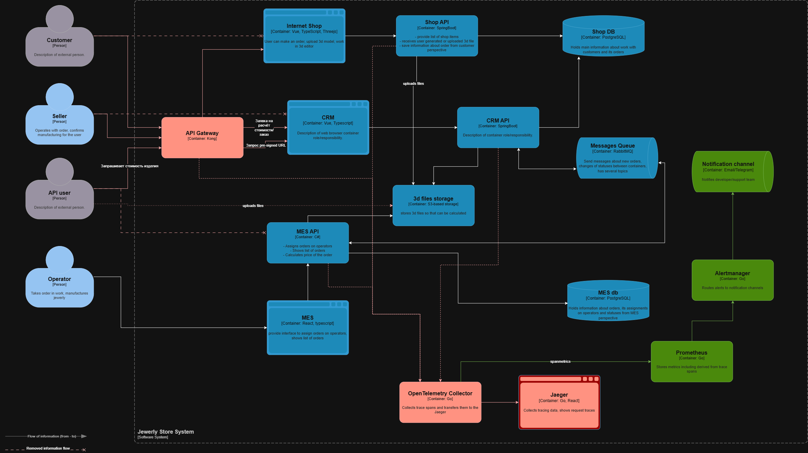

# Архитектурное решение по трейсингу

## Системы, требующие покрытия
- API Gateway
- Internet Shop – создание заказа, загрузка 3D модели в S3.
- CRM – регистрация заявки/заказа, публикация событий в очередь через Transactional Outbox.
- RabbitMQ – передача событий между CRM и MES – наиболее вероятный кандидат на потерю заказа
- MES – приём заявки на расчёт стоимости, процесс расчёта стоимости заказа, процесс смены производственных статусов
### Опасные места, где заказ может "сломаться"
- Регистрация заказа/заявки в CRM (сейчас может не произойти при сбое MES)
- Сохранение файла 3D модели в S3 (файл может не загрузиться или прийти повреждённым)
- Отправка события в шину данных (Transactional outbox должен решить эту проблему, но сейчас заказ может потеряться из-за сбоя между учётом в БД и публикацией в RabbitMQ)
- Застревание сообщения в очереди или уход в DLQ
- Взятие на расчёт заявки (расчёт может не начаться), падение расчёта (сейчас нет механизма повторного запуска, если расчёт упал), отправка результата (результат может быть не сохранён или не передан обратно)
- Статус заказа может не перейти на следующий шаг

### Что должно попасть в трейсинг
Каждый span содержит:
- Технические идентификаторы: `trace_id`, `span_id`, `parent_span_id`, время начала операции и её длительность
- Сквозной бизнес-идентификатор `order_id` — ключевой атрибут для поиска конкретного заказа в Jaeger
- Имя операции (`create_order`, `publish_event`, `consume_message`, `calculate_price`, `change_status` и т.д.)
- Для HTTP взаимодействий: `HTTP method`, `route`, `status code`
- Для очереди: `exchange`, `routing key`, `queue name`
- Для расчёта: `polygon_count` (точнее, `polygon_bucket`, так как точное значение договорились не использовать), статус заказа до и после операции
- Флаг ошибки и её тип

В трейс не должны попадать персональные данные клиентов, секреты, содержимое файлов 3D моделей, тела запросов. 

## Мотивация
В настоящее время нельзя быстро и точно сказать, на каком этапе застрял конкретный заказ. Про зависшие заказы информация хоть и приходит от клиентов, но проблема решается очень долго, в том числе благодаря отсутствию понимания, где именно сломался заказ.
Трейсинг даёт увидеть цепочку прохождения заявки/заказа по всем системам в одном месте с быстрым поиском по идентификатору и показывает, на каком шаге и с какой ошибкой остановился заказ.
Ожидается, что внедрение трейсинга:
- Позволит сократить время диагностики зависшего заказа с часов до минут.
- За счёт точной локализации проблемного места уменьшится время устранения инцидента.
- Увеличится доля заказов с полной сквозной трассировкой (в границах компании)
- Уменьшится число зависших и просроченных заказов
- Увеличится доля проблем, обнаруженных до жалобы клиента за счёт алертов на основе данных трейсинга. Также сократится время нахождения заказа в сломанном состоянии.

## Предлагаемое решение
Использовать стек OpenTelemetry во всех сервисах и передавать данные в OpenTelemetry Collector, который уже передаёт их в Jaeger.
Jaeger является как хранилищем трейсов, так и web-UI для поиска цепочек.
Для взаимодействия по протоколу OpenTelemetry необходима доработка следующих сервисов:
- API Gateway: плагин OpenTelemetry для Kong
- Internet shop API и CRM API: автоматическая инструментация HTTP-запросов и ручные span-ы для бизнес-операций вроде `create_order` и `change_status` через Micrometer Tracing.
- MES API: для инструментации используется OpenTelemetry .NET с инструментацией ASP .NET Core и HttpClientов, также добавить ручные span-ы для расчёта стоимости и изменения статусов.
- RabbitMQ: Необходимо изменить продюсеров и консьюмеров. Каждый продюсер должен добавлять в сообщение заголовок `traceparent`, консьюмер при получении извлекает его и продолжает трейс.  
- Для HTTP-вызовов для распространения контекста используется тот же заголовок `traceparent`

Каждый сервис отправляет span-ы в OpenTelemetry Collector, развёрнутый в kubernetes. Он перенаправляет span-ы в Jaeger.
Разработчик/сотрудник поддержки будет видеть полную цепочку заказа по `order_id` с длительностью каждого шага и местом ошибки (обрыва трейса).

[Диаграмма контейнеров](https://github.com/THE-KONDRAT/architecture-pro-alexandrite/blob/Exercises/Task3/jewerly_c4_model_new.drawio)

## Компромиссы
- Внешние API-клиенты не передают заголовок traceparent, поэтому заказ будет виден начиная с точки входа в систему компании. Вообще трейсинг ограничивается системой компании.
- БД и S3 хранилище не включается в трейсинг из-за дороговизны и относительно невысокой ценности инструментации. Метрик из систем мониторинга для обнаружения потенциальных проблем будет достаточно.
- MES требует доработки: добавить вручную специфические span-ы и доработать консьюмеров и продюсеров RabbitMQ
- Необходимо учитывать, что трейсинг требует затрат на хранение. Сейчас сохраняется 100% трейсов, так как количество заказов не очень большое.
Внедрение механизма по отбору трейсов – это задача на будущее. Можно будет начать со снижения частоты сохранения трейсов (не 100%, а каждый N-й), если ситуация будет совсем плачевная, то можно сохранять только ошибочные и аномально долгие трейсы.

## Безопасность
- Jaeger UI и OpenTelemetry Collector размещаются во внутренней сети и недоступны извне.
- Доступ к Jaeger UI и OpenTelemetry Collector разрешается только для сотрудников с ролью "поддержка"
- В span-ах запрещено размещать персональные и чувствительные данные, также следует размещать только минимально необходимый объём данных
- Срок хранения трейсов – 14 дней и будет уточняться по факту. Далее остаются только метрики, выведенные из трейсов.
- OpenTelemetry Collector принимает данные только от внутренних сервисов

##  Автоматический мониторинг процесса прохождения заказа
Данные трейсинга автоматически преобразуются в метрики. Для этого в OpenTelemetry Collector включается SpanMetrics Connector, генерирующий из каждого span-а метрики (количество и длительность span-ов, сгруппированных по операциям) и отправляет их в Prometheus.
На основе этих данных строятся следующие алерты:
- У заказа есть span получения сообщения из очереди MES, но нет span-а завершения дольше SLA.
- Длительность `calculate_price` возрастает
- Есть span публикации события, но нет парного span-а получения дольше N минут – свидетельство застревания сообщения в очереди
Alertmanager маршрутизирует алерты в канал поддержки/дежурному инженеру/разработчикам

[Диаграмма контейнеров](jewerly_c4_model_new_2.drawio)

