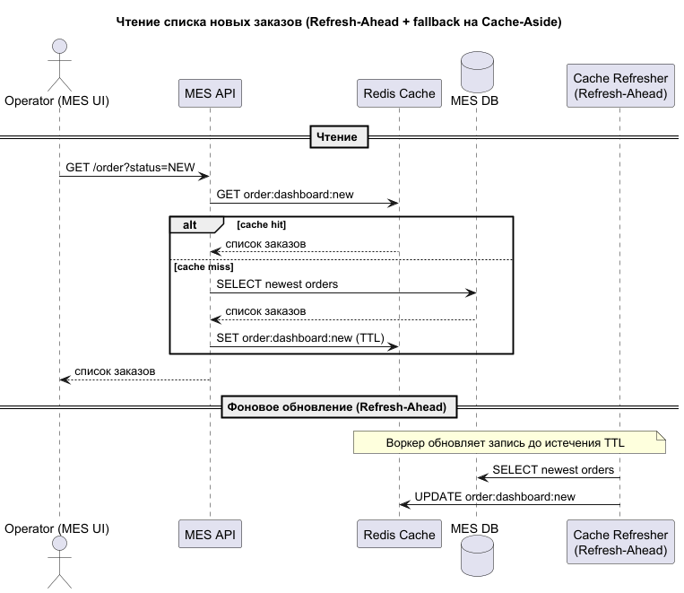
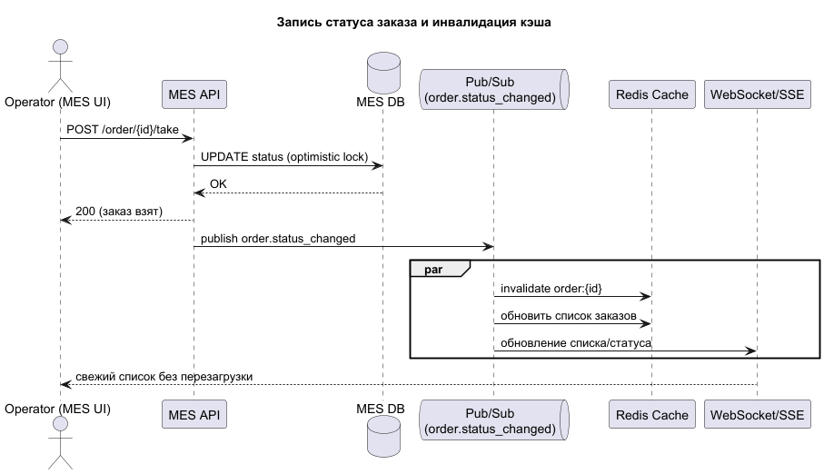

# Архитектурное решение по кешированию

## Мотивация
Дашборд MES является основным узким местом в скорости принятия и обработки заказов. Операторы MES жалуются на медленную загрузку страницы, и это оказывает прямое негативное влияние на скорость обработки заказа: запрос списка новых заказов тяжёлый, страница грузится долго, операторы видят новые заказы с опозданием. Также это снижает мотивацию при текущей модели вознаграждения. Долгие сроки выполнения заказов, на которые жалуются клиенты, во многом вытекают из этой проблемы.
Ожидаемый эффект – сокращение времени загрузки страницы с секунд до миллисекунд.

### Что нужно кэшировать
- Список новых/активных заказов
- Список заказов в работе (персонально)
- Данные карточки конкретного заказа

## Предлагаемое решение
В Web UI на стороне клиента для запроса списка используется заголовок `Cache-Control: no-cache`, чтобы браузер всегда сверялся с сервером, а сервер отдавал актуальные данные из своего кэша.
При кэшировании на стороне сервера предлагаю использовать следующие подходы

| Сервис | Сущность                              | Паттерн       | Комментарий                                                                                                                                      |
|--------|---------------------------------------|---------------|--------------------------------------------------------------------------------------------------------------------------------------------------|
| MES    | Список новых/активных заказов         | Refresh-Ahead | Запрос известен заранее, его наличие в кэше не должно зависеть от наличия/отсутствия запросов к списку                                           |
| MES    | Список заказов в работе (персонально) | Cache-Aside   | Запрос персонализированный, зависит от конкретного оператора, нет смысла держать в кэше для сотрудника, ушедшего в отпуск                        |
| MES    | Карточка конкретного заказа           | Cache-Aside   | Необходимость в кэшировании возникает только при активной работе, то есть при наличии запросов. Инвалидация по изменению состояния (программная) |

Для списка новых заказов не используется Cache-Aside или Read-Through, так как:
- Оба этих подхода при первом обращении (если кэш предварительно не прогрет) отправляются в БД
- Управление наличием данных в кэше происходит по факту запроса.
Для надёжности можно сделать fallback на запрос к БД, но в таком случае стоит задуматься об отправке алерта в поддержку, так как в штатном режиме промахов нет, и эта ветка не используется.
Write-Through не имеет смысла, так как тяжёлых операций записи, которые необходимо кэшировать, нет.
В качестве хранилища данных используется Redis.

### Диаграммы
#### Чтение
[Диаграмма последовательности](read-orders.puml)

#### Запись
[Диаграмма последовательности](write-status.puml)

### Стратегия инвалидации кэша

| Сущность                      | Первая стратегия                                                                                                                                                               | Вторая стратегия                                                                                                                                                                                                                                                           | Остальные стратегии                                                                                                                                     |
|-------------------------------|--------------------------------------------------------------------------------------------------------------------------------------------------------------------------------|----------------------------------------------------------------------------------------------------------------------------------------------------------------------------------------------------------------------------------------------------------------------------|---------------------------------------------------------------------------------------------------------------------------------------------------------|
| Список новых/активных заказов | **Программная** Происходит по смене статуса или созданию заказа (по событиям order.created/order.status_changed)                                                           | **Временная** Страхует от пропуска события, обновление происходит каждые 300 секунд                                                                                                                                                                                    | Исключительно временная требует частого обновления и будет присутствовать окно неактуальности, что может привести к конфликтам при взятии чужого заказа |
| Список заказов в работе       | **Программная** Происходит по взятию заказа в работу, смене статуса и завершению заказа.                                                                                   | **Временная** Страхует от пропуска события, обновление происходит каждые 300 секунд                                                                                                                                                                                    | Применимых нет: чистая временная даёт окно неактуальности, по-ключу для списка менее удобна                                                             |
| Карточка конкретного заказа   | **Программная** по ключу Происходит по смене статуса. Хорошо подходит, так как позволяет держать в кэше актуальное состояние объекта без инвалидации в неподходящий момент | **Временная** Скользящая с TTL 2 часа. Позволяет не держать список заказов пользователя, когда его нет на работе или когда заказ ему не нужен, при этом не позволяет обновлять кэш, когда данные фактически изменились, поэтому не может использоваться самостоятельно | Исключительно временная приведёт к окнам неактуальности и неоптимальным обновлениям кэша                                                                |

### Альтернативы

|                  | Альтернативное решение 1                                                                                                    | Альтернативное решение 2                                                                      |
|------------------|-----------------------------------------------------------------------------------------------------------------------------|-----------------------------------------------------------------------------------------------|
| Описание решения | Для списка заказов в работе (персонально) тоже refresh ahead, сверяясь с графиками отпусков/больничными/списком сотрудников | Для всех запросов использовать Cache-Aside и временную инвалидацию                            |
| Плюсы решения    | Уменьшение размера кэша за счёт отсутствия ненужных данных, которые никто запрашивать не будет                              | Проще в реализации, не нужно реализовывать механизм обновления кэша и программной инвалидации |
| Минусы решения   | Сложность реализации, необходимость интеграций с системами компании                                                         | Первое обращение может быть долгим                                                            |

Основное решение (Refresh-Ahead, Cache-Aside с программной и частично временной инвалидацией) выбрано, так как оно убирает промахи по горячему пути (в том числе при первом запросе) и даёт релевантные данные по событию заказа.

Альтернативное решение 1 (персональные списки через refresh-ahead с интеграцией кадровыми системами) отклонено из-за неоправданной сложности: ожидаемые плюсы не перекрывают сложность внедрения.

Альтернативное решение 2 (везде Cache-Aside с временной инвалидацией) отклонено из-за медленного первого обращения и окна неактуальности данных.